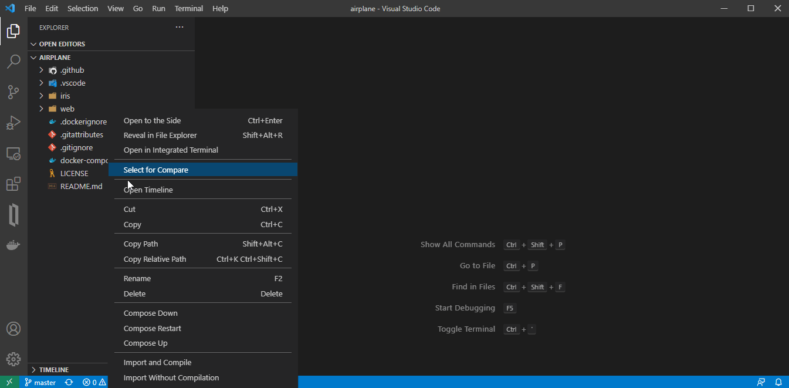
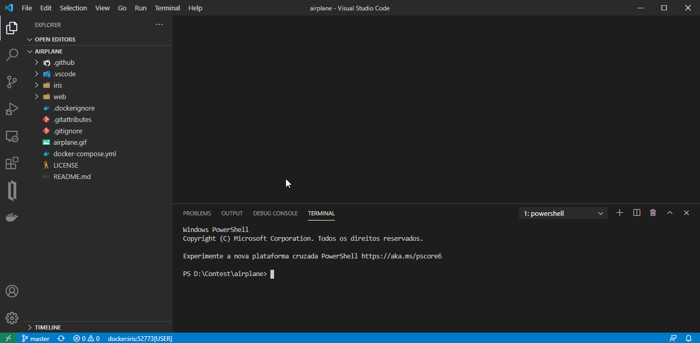

# Airplane (React, Material UI, and REST API)
This is a Demo of using React, Material UI and a REST API application in InterSystems IRIS, showing information with different types of graphics, the datasource is get from CENIPA (Aeronautical Accident Prevention and Research Center).

## Developers

:boy: Flávio Lúcio Naves Júnior [@flnaves](https://github.com/flnaves)

:older_man: Felipe França [@felipeflfranca](https://github.com/felipeflfranca) 

## Prerequisites
Make sure you have [git](https://git-scm.com/book/en/v2/Getting-Started-Installing-Git) and [Docker desktop](https://www.docker.com/products/docker-desktop) installed.

## How to Run the Application

### Installation with ZPM

```
zpm:USER>install airplane
```

### Installation

Clone/git pull the repo into any local directory e.g. like it is shown below:

```
$ git clone https://github.com/flnaves/airplane.git
```

Open the terminal in this directory and run:

```
$ docker-compose up -d --build
```

Go to /Web folder and Run the Yarn:

```
$ yarn
$ yarn start
```

That will create a url to acess the Web page:

```
http://localhost:3000/
```

or open the folder in VSCode and do the following:



# Testing

## Unit Test

To test and see if all Unit tests are working go to terminal and execute:

```
USER> do ##class(%UnitTest.Manager).RunTest(,"/nodelete")
```

Tutorial how to test:

